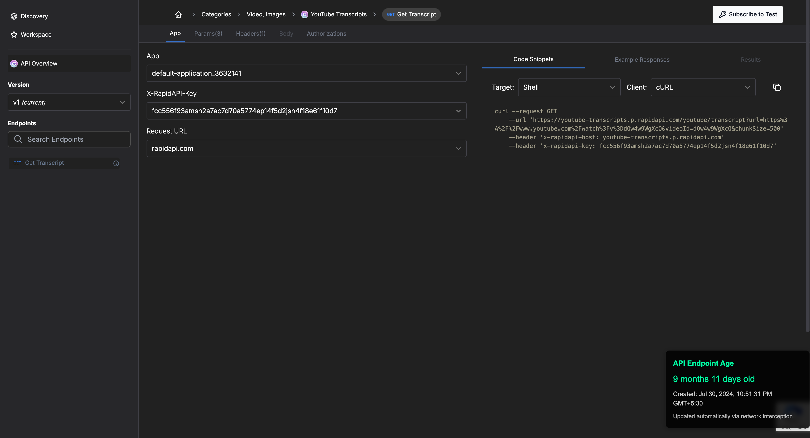

# 🚀 RapidAPI Endpoint Creation Date Extension

This Chrome extension helps you quickly view the **creation date of any API on RapidAPI**, giving you insights into how long an API has been live. It’s especially useful for developers researching API reliability, stability, and potential before integrating or building similar services.

If you're a developer targeting the RapidAPI marketplace, this tool can provide strategic insights into trending and newly added APIs worth exploring.

---

## 🔧 How to Use

1. **Download the ZIP file** from the [Releases](./releases) section.
2. **Unzip** the contents to a folder on your computer.
3. Open **Google Chrome** or any chromium base browser and navigate to `chrome://extensions/`.
4. Enable **Developer mode** (toggle in the top-right corner).
5. Click **“Load unpacked”** and select the unzipped folder.
6. Once installed, visit any API listing on [RapidAPI.com](https://rapidapi.com).
7. The extension will display the **API creation date** directly on the endpoint page.

---

## 💡 Why Use This?

- ✅ **Validate API Age**: See how long the API has been active.
- 🔍 **Research API Potential**: Identify fresh or trending APIs to build on.
- ⚠️ **Avoid Abandoned APIs**: Filter out APIs with no recent activity.
- 📊 **Competitive Analysis**: Track how long competitors' APIs have been live.

---

## 📸 Screenshots

---

## 📃 License

MIT License

---

## 🧠 Contributions

Feel free to fork this repo, suggest features, or submit PRs to enhance functionality!

---

## 🛠 Built With

- JavaScript
- Chrome Extension APIs

---

## 🤝 Support

If you find this helpful, consider giving it a ⭐️ or sharing with other developers!
